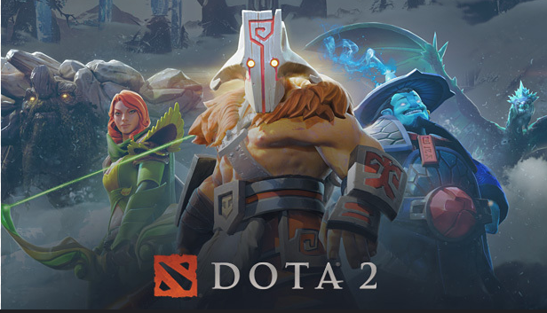
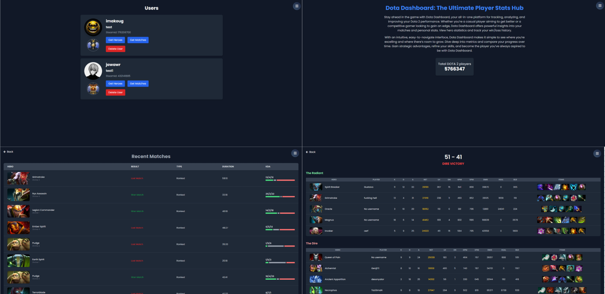

Dota Dashboard is a web app. You can add multiple accounts, analyze games, giving you detailed information about your recent matches and most played heroes.

## Screenshots



## Getting started

1. Clone the repo

```
git clone https://github.com/imakoug/dota-dashboard-project.git
cd dota-dashboard-project
```

2. Install dependencies

   ```
   npm install
   ```

3. Start server

   ```
   npm run dev
   ```

4. Go to the client and install dependencies

   ```
   cd client
   npm install
   ```

5. Start the client

   ```
   npm run dev
   ```

## Built with

- [React](https://react.dev/) - Front end library for web and native user interfaces
- [MongoDB](https://www.mongodb.com/) - Realtime database and authentication with JWT tokens
- [Express.js](https://expressjs.com/) - API
- [Socket.io](https://socket.io/) - Library that enables real-time, bidirectional and event-based communication between the browser and the server
- [OpenDota API](https://docs.opendota.com/) - Provides Dota 2 related data
- [Liquipedia API](https://liquipedia.net/dota2/Liquipedia:Dota2WebApi) - Provides Pro Dota data

## Contributing

Improvements are welcome.

Fork the repo and do your thing. Push to your fork and submit a pull request.

## Author

Pavlo Tsyhanov - [Github](https://github.com/imakoug)
